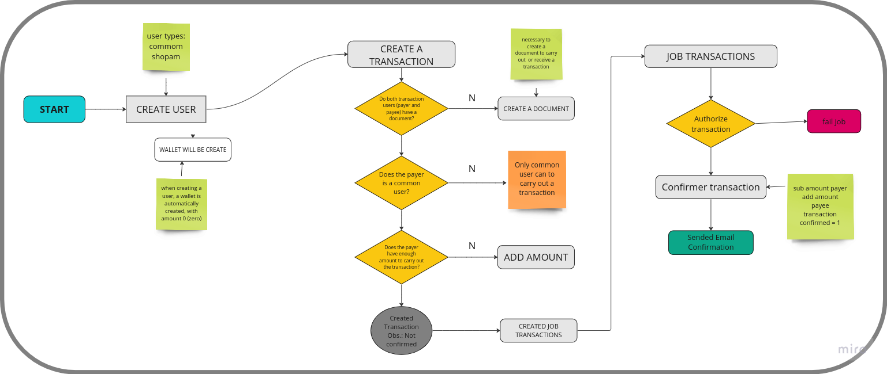

# App-Transaction

Bem-vindo ao App-Transaction! Este é um sistema desenvolvido em Laravel que permite o controle de transações entre usuários de forma eficiente e segura.

## Funcionalidades Principais

- **Registro de Transações:** Os usuários podem realizar transações entre si, caso possuam saldo para isso.
   
- **Controle de Saldo:** Os usuários podem acompanhar seus saldos e visualizar suas transações de forma clara e organizada.

- **Confirmação de Transações:** Processo em background e desacoplado para confirmação de uma transação e envio da confirmação para usuários.

- **Gestão de Usuários:** Todo o processo de usuario, carteira e documentação.

## Requisitos

- PHP >= 8.1.27
- Composer
- Laravel Framework

## Instalação

1. Clone este repositório: `git clone https://github.com/rafaeldoria/docker-laravel.git`
2. Acesse o diretório do docker: `cd docker-laravel`
3. Copie o arquivo `.env.example` para `.env`: `cp .env.example .env`
4. Configure as variáveis de ambiente no arquivo `.env`, especialmente a conexão com o banco de dados. 
5. Acesse o diretório do docker: `cd app-transactions`
6. Clone o código fonto do projeto de transações: ` git clone https://github.com/rafaeldoria/app_transactions.git . `
7. Suba os containers: `docker-compose up -d` 
8. Instale as dependências do Composer: `docker exec app-php composer install`
9. Copie o arquivo `.env.example` para `.env`: `docker exec app-php cp .env.example .env`
10. Configure as variáveis de ambiente no arquivo `.env`, especialmente a conexão com o banco de dados (as mesmas do env do passo 3).
11. Gere a chave de aplicativo: `docker exec app-php php artisan key:generate`
12. Execute as migrações do banco de dados: `docker exec app-php php artisan migrate --seed`
13. Acesse: `http://localhost:8180/api`

## Testes

docker exec app-php php artisan test --colors=always

## Documentação

Acesse:(`http://localhost:8180/api/documentation`).

## Fluxo Transação

